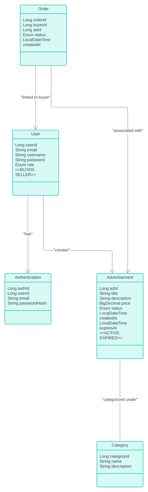

# Marketplace API

This project is a REST API for managing a marketplace application, built using Spring Boot. It enables the management of users, advertisements, and categories, and provides secure authentication using JWT.

## Features

- **User Management**: Register, authenticate users, and manage user roles.
- **Advertisement Management**: Create, update, delete, and view advertisements.
- **Category Management**: Create, update, delete, and view categories.
- **Secure API Endpoints**: Most of the API endpoints are secured using JWT-based authentication.

## Project Structure

The project follows the MVC pattern and includes the following packages:

- **controller**: Handles HTTP requests and provides REST API endpoints (`UserController`, `AdvertisementController`, `CategoryController`).
- **dto**: Data Transfer Objects to simplify communication between layers (`UserDTO`, `AdvertisementDTO`, `LoginRequest`, `JwtResponse`).
- **entity**: Defines the core data models (`User`, `Advertisement`, `Category`).
- **repository**: Handles data persistence using Spring Data JPA (`UserRepository`, `AdvertisementRepository`, `CategoryRepository`).
- **service**: Contains the business logic and acts as a bridge between controllers and repositories (`UserService`, `AdvertisementService`, `CategoryService`).
- **util**: Utility classes used across the application (`JwtUtils`, `JwtAuthenticationFilter`, `SecurityConfig`, `JwtSecretGenerator`).

## Dependencies

### Spring Boot Starters
- `spring-boot-starter-data-jpa`
- `spring-boot-starter-security`
- `spring-boot-starter-validation`
- `spring-boot-starter-web`

### Database
- `mariadb-java-client`

### JWT for Security
- `jjwt-api`, `jjwt-impl`, `jjwt-jackson`

### Lombok for Boilerplate Code Reduction
- `lombok`

### Logging
- `slf4j-api`, `logback-classic`

## Running the Application
## Running the Application

### 2. Configure the Database
- Update the `src/main/resources/application.properties` file with the appropriate database credentials.

Example configuration:
```properties
server.port=8080

# Database Configuration
spring.datasource.url=jdbc:mariadb://localhost:3306/marketplace_db
spring.datasource.username=root
spring.datasource.password=root
spring.jpa.hibernate.ddl-auto=update
spring.jpa.show-sql=true
spring.jpa.properties.hibernate.dialect=org.hibernate.dialect.MariaDBDialect

# JWT Configuration
app.jwt.secret=VWykyZ8oMfvoCIowo+/1N+3bZn7UxrI0wIQWfo76nUg=
app.jwt.expirationMs=86400000

# CORS Configuration (if needed)
spring.web.cors.allowed-origins=http://localhost:3000
spring.web.cors.allowed-methods=GET,POST,PUT,DELETE
spring.web.cors.allowed-headers=Authorization,Content-Type

